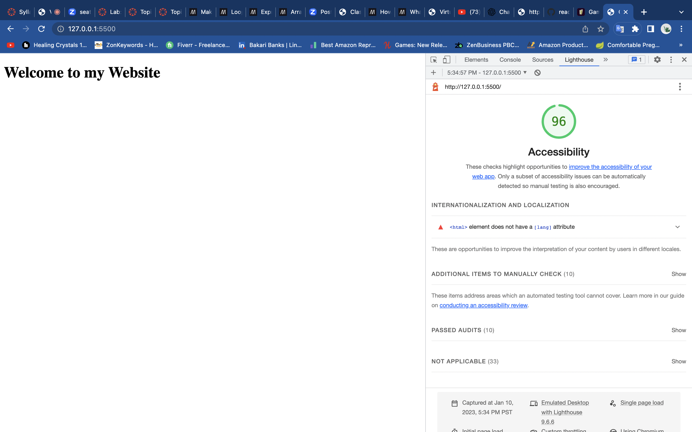
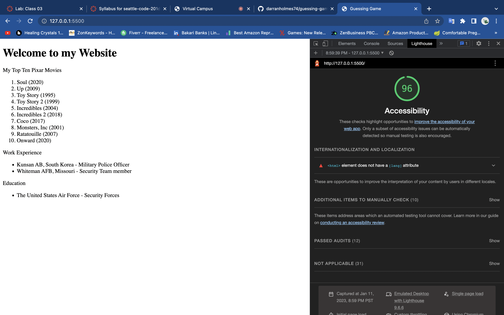

# guessing-game-darrranholmes

Guessing Game for Lab 2

# Demo: Class 02

## Guessing Game

A Guessing Game about Darran. A simple input and output quiz, using confirm and prompt functions. Asks the user question about Darran, and tells them whether they are right or wrong.

## Pair Programing
#### Made logical statements into functions

Driver - Rhett Beardemphl
Navigator - Darran Holmes

## Author: Darran Holmes

## Links

